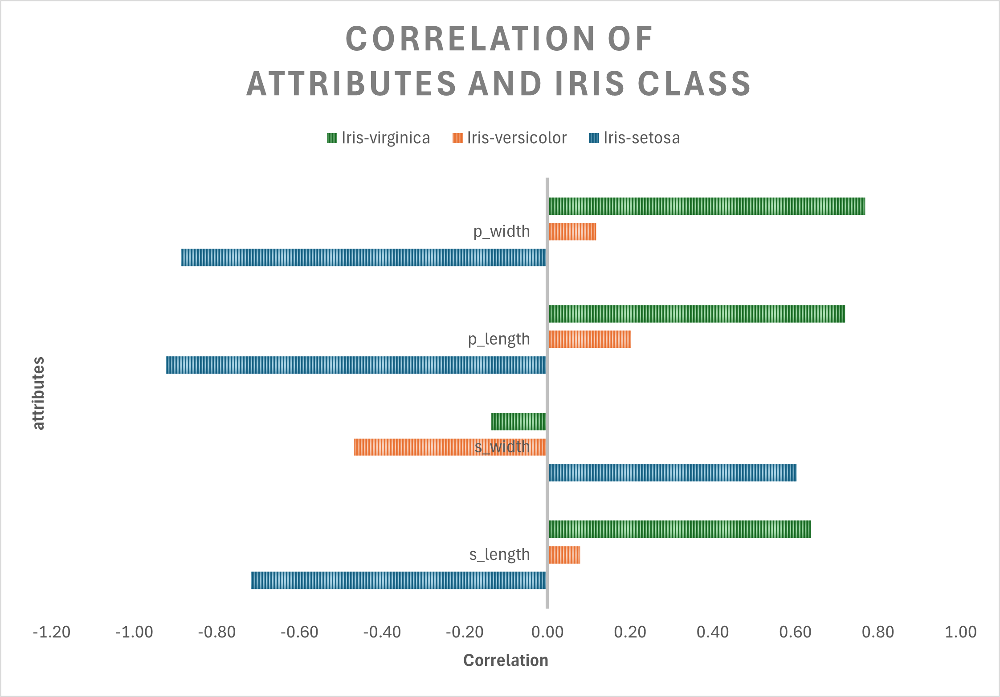

# Spreadsheet Analysis
## By Sophia Wu
## Original Data
This Iris dataset donated by R.A.Fisher to the UC Irvine Machine Learning Repository is one of the earliest datasets used in the literature on classification methods and widely used in statistics and machine learning.  The data set contains 3 classes of 50 instances each, where each class refers to a type of iris plant. [Here](https://archive.ics.uci.edu/dataset/53/iris) is the link to the data source. The original dataset is in CSV format.

Below are the first 11 rows of the original dataset (The original dataset doesn't include header. I added them myself for visualization purpose):
| Sepal Length | Sepal Width | Petal Length | Petal Width | Class       |
|--------------|-------------|--------------|-------------|---------------|
| 5.1          | 3.5         | 1.4          | 0.2         | Iris-setosa   |
| 4.9          | 3.0         | 1.4          | 0.2         | Iris-setosa   |
| 4.7          | 3.2         | 1.3          | 0.2         | Iris-setosa   |
| 4.6          | 3.1         | 1.5          | 0.2         | Iris-setosa   |
| 5.0          | 3.6         | 1.4          | 0.2         | Iris-setosa   |
| 5.4          | 3.9         | 1.7          | 0.4         | Iris-setosa   |
| 4.6          | 3.4         | 1.4          | 0.3         | Iris-setosa   |
| 5.0          | 3.4         | 1.5          | 0.2         | Iris-setosa   |
| 4.4          | 2.9         | 1.4          | 0.2         | Iris-setosa   |
| 4.9          | 3.1         | 1.5          | 0.1         | Iris-setosa   |

## Data Scrubbing
To streamline the Excel analysis of the Iris dataset, several preparatory steps were taken:

1. I introduced descriptive headers for each column to clarify the data, such as 'Sepal Length', 'Sepal Width', etc.
2. I added an 'Index' column starting from 1 to uniquely identify each entry, facilitating easier data manipulation.
3. I converted all numerical values to two decimal places for consistency. 
4. I encoded Iris species into three new columns for correlation analysis, using 1 for the target class and 0 for others, making later statistical calculations straightforward.

Links to my datafiles:
1. [bezdekIris.data](data/bezdekIris.data)
2. [clean_data.csv](data/clean_data.csv)
3. [clean_data.xlsx](data/clean_data.xlsx)

## Data Analysis
Using Excel functions `MAX`, `MIN`, `AVERAGE`, and `STDEV.S`, I calculated the key statistical metrics for the Iris dataset's attributes and presented them in a chart titled "STATISTICS FOR IRIS ATTRIBUTES". The chart allows us to draw several insights:

The range (Max - Min) for sepal length and petal length is notably broad, indicating that these attributes vary significantly across the Iris samples. This is in contrast to the sepal width and petal width, which exhibit a narrower range of values.
Petal length shows the highest standard deviation, suggesting that its measurements are the most dispersed around the mean, indicating high variability. On the other hand, sepal width has the lowest standard deviation, meaning its values are more consistently close to the mean, denoting low variability.

See Chart 1 **STATISTICS FOR IRIS ATTRIBUTES** 

To explore the relationship between the attributes of Iris flowers and their classifications, I produced a chart entitled "MEAN ATTRIBUTES OF IRIS TYPE." This grouped bar chart visually compares the average measurements of sepal length, sepal width, petal length, and petal width across three Iris species. Observations from the chart include:

1. Iris-setosa typically has shorter yet broader sepals than Iris-virginica and Iris-versicolor.
2. Iris-virginica is distinguished by having the largest petal dimensions, which are useful traits for differentiating it from the other species.
3. Iris-versicolor exhibits intermediate attribute values, placing it size-wise between Iris-setosa and Iris-virginica.
4. The noticeable variances in petal length and width among the species indicate these features are vital for species identification.
5. Each Iris species exhibits unique size characteristics across all attributes, underscoring their morphological distinctiveness, beneficial for classification.

See Chart 2 **MEAN ATTRIBUTES OF IRIS TYPE** 

Finally, I use the `CORREL` function to calculate the correlation of various attributes with three classes of Iris flowers. Each bar represents the strength and direction of the correlation between the flower's physical attributes and its classification as one of the three species.

From this chart, one can deduce the following insights:

1. Petal Width: Shows a strong positive correlation with Iris-virginica, which suggests that a larger petal width is a good indicator of an Iris flower being of this specific class. Conversely, it shows a strong negative correlation with Iris-setosa, indicating that a smaller petal width could be characteristic of the Iris-setosa species.
2. Similarly, longer petals are a distinguishing feature of Iris-virginica, while shorter petals are more typical of Iris-setosa.
3. Sepal Width (s_width): There's a negative correlation with Iris-virginica and a positive correlation with Iris-setosa. This indicates that Iris-setosa tends to have wider sepals compared to Iris-virginica.
4. Sepal Length (s_length): The correlation is less pronounced for sepal length, but it does show a slight positive correlation with Iris-virginica and a slight negative one with Iris-setosa, though these are not as strong as the correlations with petal measurements.

See Chart 3 **CORRELATION OF ATTRIBUTES AND IRIS CLASS** 

## Conclusion
From the above three analysis, one can conclude that petal measurements (length and width) are highly correlated with Iris species classification, more so than sepal measurements. This implies that petal size is a significant indicator of the Iris species and can be heavily weighted in classification models.

The direction of the correlations can help in predicting the species from the flower measurements. For instance, a flower with small petal width and length is likely to be Iris-setosa, whereas a flower with larger petal dimensions is likely to be Iris-virginica.

Iris-versicolor shows moderate correlation values, suggesting that its features are intermediate and not as distinctly separated from the other species as Iris-setosa and Iris-virginica are from each other.